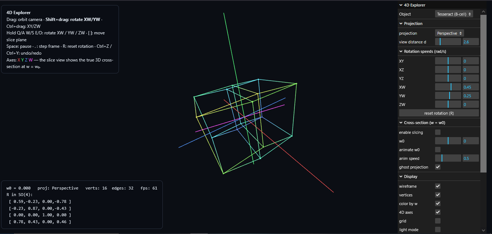

# 4D Tesseract Explorer

Interactive visualization of four-dimensional geometry built for learning and exploration.

## Features

- Interactive 4D Tesseract visualization
- Real-time rotations in all six 4D rotation planes
- Multiple projection modes
- Cross-section (hyperplane slicing)
- Adjustable rotation speeds
- Interactive controls
- Browser-based application (no installation required for users)

## Live Demo

https://dav4h.github.io/4D-Tesseract-explorer/

## Technologies

- JavaScript (ES Modules)
- Three.js
- HTML5
- WebGL

## Running Locally

```bash
npm install
npm start
```

## Screenshots

(Add screenshots here)

## Roadmap

- Improve rendering quality
- Add more 4D polytopes
- Better educational explanations
- Performance optimizations
- VR support

## Acknowledgements

This project was developed with extensive assistance from AI tools. The project direction, feature planning, testing, iteration, and publication were managed by the repository owner.

## License

MIT